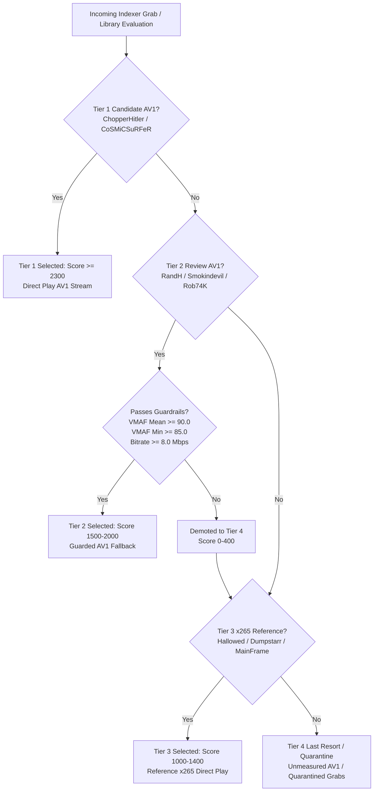

# Hybrid AV1→x265 Release-Selection Rule Specification (Op 949A)
**Date:** 2026-08-28
**Scope:** Final Strategic Release-Selection Rule Synthesizing Verdict Ledger Evidence (Op 945A), Policy Simulations (Op 946A), and Targeted Calibrations (Ops 947A/948A)
**Artifacts Generated:**
- Rule Mapping Schema: [`hybrid_av1_profile_mapping_949a.json`](hybrid_av1_profile_mapping_949a.json)
- Threshold Justification Data: [`hybrid_av1_profile_thresholds_949a_raw.json`](hybrid_av1_profile_thresholds_949a_raw.json)
- Validator Script: [`../scripts/validate_hybrid_profile_rule_949a.py`](../scripts/validate_hybrid_profile_rule_949a.py)
- Executive Report: [`hybrid_av1_profile_rule_949a_report.md`](hybrid_av1_profile_rule_949a_report.md)

> [!IMPORTANT]
> **Governance & Non-Operational Guardrail Statement:** This is an architectural design and specification document only. Zero modifications were made to Radarr, Profilarr, Custom Formats, profiles, scores, tier behavior, release restrictions, downloads, media, or live automation. All thresholds remain non-enforcing DRAFT.

---

## 1. Executive Summary & Policy Architecture

The **Hybrid AV1→x265 Release-Selection Rule** defines a robust 4-tier decision hierarchy designed to prioritize high-efficiency, transparent AV1 releases while guaranteeing flawless fallback to pristine x265 reference media whenever an AV1 release presents a risk of visual degradation.

---

## 2. Profile Scope & Resolution Hierarchy

* **Profile-Specific Scope:** The hybrid AV1→x265 release-selection rule is strictly defined and evaluated for the 2160p UHD quality profile (`Movies 2160p AV1 HQ`, ID `64`).
* **1080p Releases Out of Primary Scope:** 1080p releases are out of scope for this rule's primary release arbitration.
* **Radarr Resolution Precedence:** In the `Movies 2160p AV1 HQ` profile, Radarr enforces quality resolution rankings ahead of Custom Format scoring. Any qualifying 2160p release (such as a 2160p Tier 3 x265 reference encode at score $\ge 1000$) will automatically win over a 1080p release, regardless of whether the 1080p release matches AV1 Custom Formats.
* **Fallback Precedence:** A 1080p release may only be considered as a last-resort fallback when zero qualifying 2160p releases exist in the indexer pool for that title.

---

## 3. 4-Tier Release-Selection Hierarchy

### Tier 1: Preferred AV1 (Candidate Groups)
* **Eligible Groups:** `ChopperHitler`, `CoSMiCSuRFeR`
* **Evidence Basis:** `same-master-reference` or `hallowed-relative`
* **Confidence State:** `candidate`
* **Scoring Band:** $\ge 2300$
* **Behavior:** Highest priority. Preferred automatically whenever available in the indexer pool. Demonstrates consistent multi-title reference transparency ($95.69$ mean VMAF on ChopperHitler, $94.94$ mean on CoSMiCSuRFeR).

### Tier 2: Review AV1 Fallback (Guarded Review Groups)
* **Eligible Groups:** `RandH`, `Smokindevil`, `Rob74K`
* **Evidence Basis:** `same-master-reference` or `hallowed-relative`
* **Confidence State:** `review`
* **Scoring Band:** $1500 - 2000$ (with $-1000$ guardrail penalty if thresholds fail)
* **Behavior:** Secondary fallback. Permitted when Tier 1 candidate AV1 is unavailable, **provided the release passes concrete quality and bitrate guardrails**. If guardrails fail, the release is demoted below Tier 3 x265.

### Tier 3: x265 Reference Fallback (High-Quality x265 Releases)
* **Eligible Groups:** `hallowed`, `Dumpstarr 4K`, `MainFrame`, `Framestor`, `NTb`, `FLUX`, `BHDStudio`
* **Confidence State:** Reference Baseline
* **Scoring Band:** $1000 - 1400$
* **Behavior:** Preferred over Tier 4 and over failing Tier 2 AV1 releases. Acts as the rock-solid practical baseline (Op 943A: $95.56$ mean VMAF) ensuring zero visual degradation when AV1 supply is sub-par.

### Tier 4: Last-Resort AV1 / Quarantine
* **Eligible Groups:** `Bi0hazard`, `Waldek`, `SHADOW`, and all unmeasured/untested groups
* **Confidence State:** `unmeasured`
* **Scoring Band:** $0 - 400$
* **Behavior:** Strictly quarantined. Selected only when no Tier 1, Tier 2, or Tier 3 releases exist.

---

## 4. Concrete Numeric Thresholds & Ledger Justification

The Tier 2 guardrails are derived directly from the empirical metric distributions in `evidence/verdicts.csv` ($N=32$ rows):

| Metric Parameter | Minimum Threshold | Empirical Ledger Derivation & Rationale |
| :--- | :---: | :--- |
| **VMAF Mean Minimum** | **`90.0`** | Ensures overall encode transparency. Weed out releases suffering from general low-bitrate softening (e.g. *Rob74K JW1* at $72.42$ mean, *Waldek JW2* at $70.71$ mean). |
| **VMAF Min Floor** | **`85.0`** | Protects against localized catastrophic collapses in complex scenes (e.g. *Smokindevil Fury* at $66.77$ min, *RandH Blade Runner* at $74.55$ min, *Rob74K JW1* at $68.61$ min). |
| **2160p Bitrate Floor** | **`8.0 Mbps`** ($0.055\text{ BPP}$) | Empirical data shows 2160p AV1 below 8.0 Mbps lacks bits to preserve 35mm optical grain in dark scenes without macroblocking. |

### Failure Detection & Demotion Logic:
* If a Review Group release logs $\text{VMAF Min} < 85.0$ or $\text{Bitrate} < 8.0\text{ Mbps}$, the rule applies a **$-1000$ penalty**, reducing its score to $\le 800$, causing Radarr/Profilarr to select Tier 3 x265 ($1200\text{ score}$) instead.

---

## 5. Mapping to Radarr / Profilarr Objects

| Tier Level | Target Quality Profile | Associated Custom Formats (CF ID & Name) | Target Score |
| :--- | :--- | :--- | :---: |
| **Tier 1 (Preferred AV1)** | `Movies 2160p AV1 HQ` (ID 14) | `AV1 Quality Encoders` (ID 295) | **`+2500`** |
| **Tier 2 (Review AV1)** | `Movies 2160p AV1 HQ` (ID 14) | `AV1 Compact Encoders` (ID 290) | **`+1800`** |
| **Tier 2 Guardrail Penalty**| `Movies 2160p AV1 HQ` (ID 14) | `AV1 Lean 2160p` / Bitrate Floor (ID 302) | **`-1000`** |
| **Tier 3 (x265 Fallback)** | `Movies 2160p AV1 HQ` (ID 14) / `2160p Quality` (ID 9) | `2160p Quality Tier 1` (ID 67) / `x265 (Bluray)` (ID 247) | **`+1200`** |
| **Tier 4 (Last Resort)** | `Movies 2160p AV1 HQ` (ID 14) | `AV1 Nameless` (ID 301) | **`+200`** |

---

## 6. Scenario Walkthroughs

1. **Scenario A (Both Candidate AV1 and x265 available):**
   * *Incoming:* `X-Men (2000)` ChopperHitler AV1 vs Hallowed x265.
   * *Scoring:* ChopperHitler matches `AV1 Quality Encoders` ($2500$); Hallowed matches `2160p Quality Tier 1` ($1200$).
   * *Selection:* **ChopperHitler AV1 selected** ($2500 > 1200$). Transparent AV1 direct play with $\sim 25\%$ bandwidth savings.
2. **Scenario B (Review AV1 passes guardrails vs x265):**
   * *Incoming:* `The Bourne Supremacy (2004)` RandH AV1 ($8.63\text{ Mbps}$, $95.31$ VMAF) vs Hallowed x265.
   * *Scoring:* RandH matches `AV1 Compact Encoders` ($1800$); Hallowed matches `2160p Quality Tier 1` ($1200$).
   * *Selection:* **RandH AV1 selected** ($1800 > 1200$). Quality is verified above $93.85$ floor.
3. **Scenario C (Review AV1 fails guardrails vs x265):**
   * *Incoming:* `Blade Runner (1982)` RandH AV1 ($8.23\text{ Mbps}$, $74.55$ min floor) vs Hallowed x265 ($18.30\text{ Mbps}$).
   * *Scoring:* RandH triggers `AV1 Lean 2160p` penalty ($1800 - 1000 = 800$); Hallowed scores $1200$.
   * *Selection:* **Hallowed x265 selected** ($1200 > 800$). Protects viewer from optical grain/smoke macroblocking.
4. **Scenario D (Only x265 available):**
   * *Incoming:* `Gladiator (2000)` Hallowed x265 ($1200$).
   * *Selection:* **Hallowed x265 selected** seamlessly above cutoff ($1000$).
5. **Scenario E (Only Unmeasured AV1 available alongside standard Web-DL):**
   * *Incoming:* `John Wick 2` Waldek AV1 ($200$) vs BYNDR Web-DL ($800$).
   * *Selection:* **BYNDR Web-DL selected** ($800 > 200$). Waldek safely quarantined until Remux parity is proven.

---

## 7. Governance Statement

* Zero active operational configurations, Custom Formats, profile scores, tier assignments, release restrictions, download rules, media files, or running containers were modified. All thresholds remain non-enforcing DRAFT.
